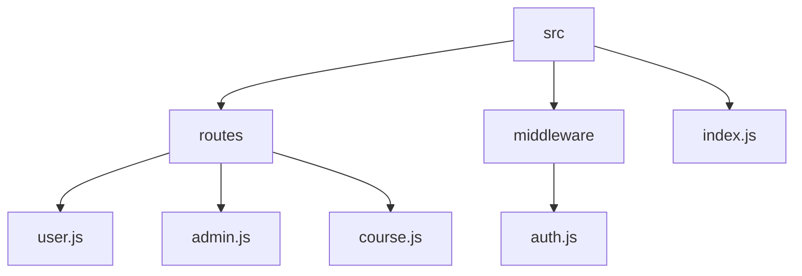

# Course Management System 🚀

## 🗂️ Description

The Course Management System is a comprehensive platform designed for managing courses, users, and admins. It provides a robust backend API for course creation, user registration, and admin authentication. This project aims to streamline course management processes, making it easier for admins to create and manage courses, and for users to purchase and access courses.

The system consists of a Node.js backend, utilizing Express.js, Prisma, and MongoDB to provide a scalable and efficient data storage solution. The API handles various endpoints for user and admin authentication, course management, and user-course interactions.

## ✨ Key Features

### **Authentication and Authorization** 🔒

* User registration and login
* Admin registration and login
* Token-based authentication and authorization

### **Course Management** 📚

* Course creation, updating, and deletion (admin-only)
* Course retrieval (public and user-specific)
* User-course interactions (purchase and purchase status)

### **Data Modeling** 📊

* Prisma schema defining data models for Admin, User, Course, and UserCourse

## 🗂️ Folder Structure

## 🛠️ Tech Stack

## ⚙️ Setup Instructions

To run the project locally:

* Clone the repository: `git clone https://github.com/ebhay/CourseManagmentSystem.git`
* Install dependencies: `npm install`
* Create a `.env` file based on the `env.template` file
* Run the application: `npm start`

## 🚨 GitHub Actions

This repository uses GitHub Actions for automated testing and deployment. The workflow is defined in the `.github/workflows/main.yml` file.

## 📝 API Endpoints

The API provides various endpoints for user and admin authentication, course management, and user-course interactions. These endpoints are defined in the `routes` directory.

## 📊 Database Schema

The database schema is defined in the `prisma/schema.prisma` file, which uses Prisma's data modeling syntax to define the data models for Admin, User, Course, and UserCourse.

  

<h3>Abhay Gupta</h3>

Passionate developer & lifelong learner, seeking to break boundaries through code.

 

  <a href="https://gitfull.vercel.app">Made by GitFull</a>

    